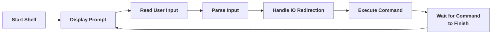

# EnseaSH - Linux Micro Shell Mini Project
EnseaSH is a minimal Unix shell developed as part of an academic lab project.
It allows users to execute system commands while displaying exit codes, signals, and execution times for each program.

The project has strict low-level programming constraints, for example, the use of `printf` and `system` is prohibited.

## Implemented Features
- Welcome message and prompt
- REPL loop (Read-Eval-Print Loop)
  - Read user input
  - Execute commands
  - Return to prompt
- Shell exit
- Exit status and signal display
- Execution time measurement
- Commands with arguments
- Input/Output redirections
  - `<` for stdin
  - `>` for stdout

Here is a demonstration of the different features:
```shell
Welcome to enseash!
To exit, type 'exit'
enseash % whatever                          
whatever: No such file or directory
enseash [exit:1|1ms] % sort < names.txt > sorted_names.txt
enseash [exit:0|2ms] % ls
build  demo.txt  include   names.txt  sorted_names.txt
case.  enseash   Makefile  README.md  src
enseash [exit:0|3ms] % rm names.txt sorted_names.txt
enseash [exit:0|2ms] % sleep 100000
enseash [sign:9|10592ms] % exit
see you soon ;)
```

## Planned Features
- Pipes (`|`) 
```shell
enseash % ls | wc -l
44
enseash [exit:0|5ms]%
```
- Background execution (`&`)
  - Non-blocking execution
  - Process tracking
  - correct timing using `wait4`
```shell
enseash % sleep 10 &
[1] 3656
enseash [1&] %
[1]+ Ended: sleep 10 &
enseash [exit: 0|10s] %
```

## Project Structure
```
enseash-linux-micro-shell/
├── build/                 # object files
├── include/               
│   ├── config.h           # global constants and macros
│   ├── shell.h            
│   └── utils.h
├── src/                  
│   ├── main.c
│   ├── shell.c            # shell logic (prompt & REPL)
│   └── utils.c
├── Makefile
├── README.md
└── .gitignore
```
## Code Organization
### `shell.c`
Contains the core shell logic, contains two functions:
- `welcome_prompt()`  
  Acts like a `setup()` function: displays the welcome message and the first shell prompt.
- `input_scan()`  
  Acts like a `loop()` function:
  - Scans user input
  - Parses commands
  - Passes execution to functions
  - Displays the prompt with execution feedback

### `utils.c`
Contains utility functions used across the shell implementation.
- `myprint()`  
  Writes strings to standard output using `write()`.
- `myscan()`  
  Reads user input from standard input using `read()` and ensures the buffer is null-terminated.
- `string_split()`  
  Splits a command line into an argument vector (`argv`) compatible with `execvp()`.
- `command_exec()`  
  Executes a command in a child process and handles I/O redirections. Waits for termination in the parent process.  
  Returns the status value to distinguis between normal termination and error or signal based terminations.

# EnseaSH - Linux Micro Shell Mini Project
EnseaSH is a minimal Unix shell developed as part of an academic lab project.
It allows users to execute system commands while displaying exit codes, signals, and execution times for each program.

The project has strict low-level programming constraints, for example, the use of `printf` and `system` is prohibited.

## Implemented Features
- Welcome message and prompt
- REPL loop (Read-Eval-Print Loop)
  - Read user input
  - Execute commands
  - Return to prompt
- Shell exit
- Exit status and signal display
- Execution time measurement
- Commands with arguments
- Input/Output redirections
  - `<` for stdin
  - `>` for stdout

Here is a demonstration of the different features:
```shell
Welcome to enseash!
To exit, type 'exit'
enseash % whatever                          
whatever: No such file or directory
enseash [exit:1|1ms] % sort < names.txt > sorted_names.txt
enseash [exit:0|2ms] % ls
build  demo.txt  include   names.txt  sorted_names.txt
case.  enseash   Makefile  README.md  src
enseash [exit:0|3ms] % rm names.txt sorted_names.txt
enseash [exit:0|2ms] % sleep 100000
enseash [sign:9|10592ms] % exit
see you soon ;)
```

## Planned Features
- Pipes (`|`) 
```shell
enseash % ls | wc -l
44
enseash [exit:0|5ms]%
```
- Background execution (`&`)
  - Non-blocking execution
  - Process tracking
  - correct timing using `wait4`
```shell
enseash % sleep 10 &
[1] 3656
enseash [1&] %
[1]+ Ended: sleep 10 &
enseash [exit: 0|10s] %
```

## Project Structure
```
enseash-linux-micro-shell/
├── build/                 # object files
├── include/               
│   ├── config.h           # global constants and macros
│   ├── shell.h            
│   └── utils.h
├── src/                  
│   ├── main.c
│   ├── shell.c            # shell logic (prompt & REPL)
│   └── utils.c
├── Makefile
├── README.md
└── .gitignore
```
## Code Organization
### `shell.c`
Contains the core shell logic, contains two functions:
- `welcome_prompt()`  
  Acts like a `setup()` function: displays the welcome message and the first shell prompt.
- `input_scan()`  
  Acts like a `loop()` function:
  - Scans user input
  - Parses commands
  - Passes execution to functions
  - Displays the prompt with execution feedback

### `utils.c`
Contains utility functions used across the shell implementation.
- `myprint()`  
  Writes strings to standard output using `write()`.
- `myscan()`  
  Reads user input from standard input using `read()` and ensures the buffer is null-terminated.
- `string_split()`  
  Splits a command line into an argument vector (`argv`) compatible with `execvp()`.
- `command_exec()`  
  Executes a command in a child process and handles I/O redirections. Waits for termination in the parent process.  
  Returns the status value to distinguis between normal termination and error or signal based terminations.

## Shell call flow

